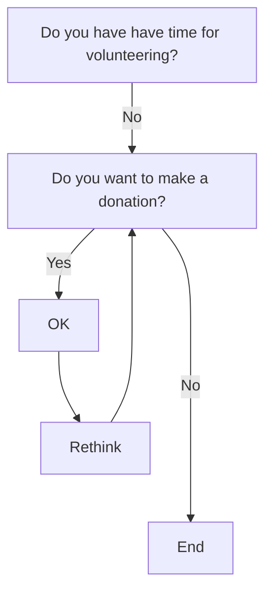

```mermaid
flowchart TD;
    A[Do you have have time for volunteering?] --> |No| B[Do you want to make a donation?]
    B -->|Yes| C[OK]
    C --> D[Rethink]
    D --> B
    B ---->|No| E[End]
    
```
