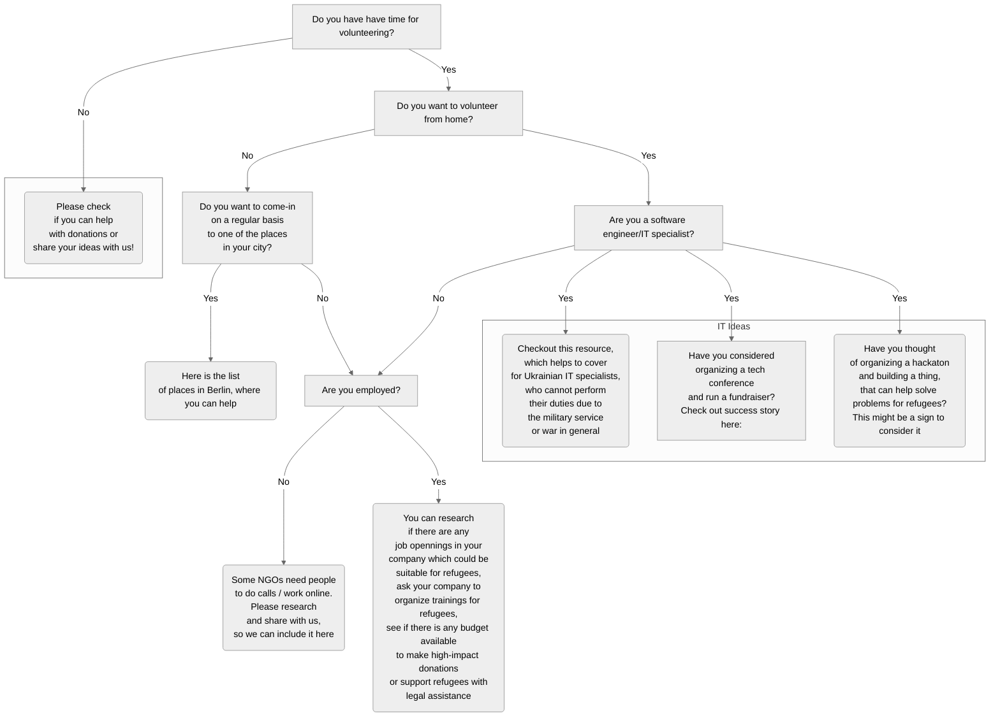
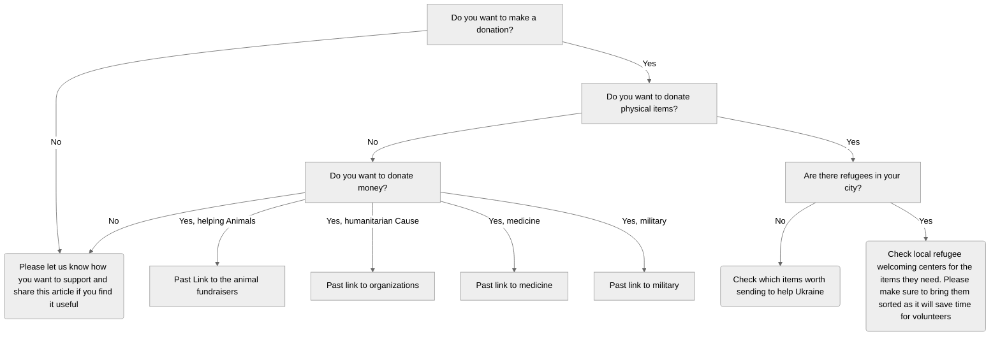

```mermaid
%%{init: {'theme':'neutral'}}%%
flowchart TD;
    A[Do you have have time for volunteering?] ---> |No| W(Please check<br/>if you can help<br/>with donations or<br/>share your ideas with us!)
    A -->|Yes| K[Do you want to volunteer from home?]
    K -->|No| L[Do you want to come-in<br/>on a regular basis<br/>to one of the places<br/>in your city?]
    L -->|Yes| Q(Here is the list<br/>of places in Berlin, where you can help)
    L -->|No| M[Are you employed?]
    M -->|No| R(Some NGOs need people<br/>to do calls / work online.<br/>Please research <br/>and share with us,<br/>so we can include it here)
    M -->|Yes| S(You can research<br/>if there are any<br/>job opennings in your<br/>company which could be<br/>suitable for refugees,<br/>ask your company to<br/>organize trainings for refugees,<br/>see if there is any budget available<br/>to make high-impact donations<br/>or support refugees with<br/>legal assistance)
    K -->|Yes| N[Are you a software engineer/IT specialist?]
    N -->|No| M
    N -->|Yes| T(Checkout this resource,<br/>which helps to cover<br/>for Ukrainian IT specialists,<br/>who cannot perform<br/>their duties due to<br/>the military service<br/>or war in general)
    N -->|Yes| O[Have you considered<br/>organizing a tech conference<br/>and run a fundraiser?<br/>Check out success story here: ]
    N -->|Yes| U(Have you thought<br/>of organizing a hackaton<br/>and building a thing,<br/>that can help solve problems for refugees?<br/>This might be a sign to consider it)
    subgraph IT Ideas
        T
        O
        U
    end
    subgraph  
        W
    end
```

```mermaid
%%{init: {'theme':'neutral'}}%%
flowchart TD;
    B[Do you want to make a donation?] -->|No| E(Please let us know how you want to support and share this article if you find it useful)
    B -->|Yes| C[Do you want to donate physical items?]
    C -->|No| D[Do you want to donate money?]
    D -->|No| E
    D -->|Yes, helping Animals| F[Past Link to the animal fundraisers]
    D -->|Yes, humanitarian Cause| G[Past link to organizations]
    D -->|Yes, medicine| H[Past link to medicine]
    D -->|Yes, military| I[Past link to military]
    C -->|Yes| J[Are there refugees in your city?]
    J -->|No| K(Check which items worth sending to help Ukraine)
    J -->|Yes| L(Check local refugee welcoming centers for the items they need. Please make sure to bring them sorted as it will save time for volunteers)
```
