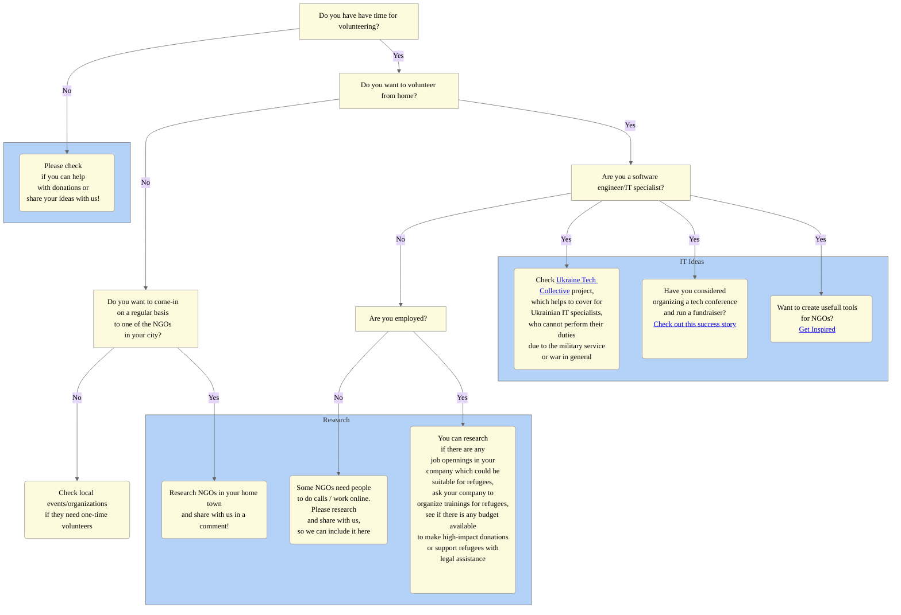
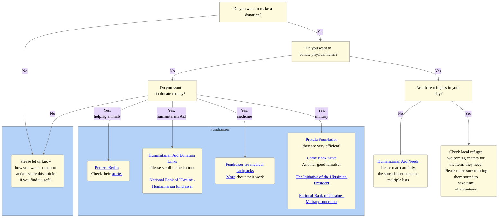

```mermaid
%%{init: {'theme':'neutral', 'themeVariables': { 
'clusterBkg': '#b4d2f8', 
'mainBkg': '#fdfade',
'edgeLabelBackground':'#e7d7fa',
'fontFamily': 'sans-serif'
}}}%%
flowchart TD;
    A[Do you have have time for volunteering?]
    C(Please check<br/>if you can help<br/>with donations or<br/>share your ideas with us!)
    D[Do you want to volunteer from home?]
    E[Do you want to come-in<br/>on a regular basis<br/>to one of the NGOs<br/>in your city?]
    F(Research NGOs in your home town<br/>and share with us in a comment!)
    G(Some NGOs need people<br/>to do calls / work online.<br/>Please research <br/>and share with us,<br/>so we can include it here)
    S(You can research<br/>if there are any<br/>job opennings in your<br/>company which could be<br/>suitable for refugees,<br/>ask your company to<br/>organize trainings for refugees,<br/>see if there is any budget available<br/>to make high-impact donations<br/>or support refugees with<br/>legal assistance)
    N[Are you a software engineer/IT specialist?]
    M[Are you employed?]
    T(Check <a href='https://www.ukrainetechcollective.com/'>Ukraine Tech Collective</a> project,<br/>which helps to cover for<br/>Ukrainian IT specialists,<br/>who cannot perform their duties<br/>due to the military service<br/>or war in general)
    O(Have you considered<br/>organizing a tech conference<br/>and run a fundraiser?<br/><a href='https://devfest.gdg.org.ua/'>Check out this success story</a>)
    U(Want to create usefull tools<br/>for NGOs?<br/><a href='https://monday.com/blog/news/putting-tech-to-good-use-how-monday-com-is-supporting-ngos-in-ukraine/'>Get Inspired</a>)
    V(Check local events/organizations<br/>if they need one-time volunteers)
    
    A ---> |No| C
    A -->|Yes| D
    D -->|No| E
    E -->|No| V
    E -->|Yes| F
    M -->|No| G
    M -->|Yes| S
    D -->|Yes| N
    N -->|No| M
    N -->|Yes| T
    N -->|Yes| O
    N -->|Yes| U
    subgraph IT Ideas
        T
        O
        U
    end
    subgraph  
        C
    end
    subgraph Research
        G
        F
        S
    end
```

```mermaid
%%{init: {'theme':'neutral', 'themeVariables': { 
'clusterBkg': '#b4d2f8', 
'mainBkg': '#fdfade',
'edgeLabelBackground':'#e7d7fa',
'fontFamily': 'sans-serif'
}}}%%
flowchart TD;
    B[Do you want to make a donation?]
    E(Please let us know<br/>how you want to support<br/>and/or share this article<br/>if you find it useful)
    C[Do you want to<br/>donate physical items?]
    D[Do you want<br/>to donate money?]
    F(<a href='https://linktr.ee/petners.berlin'>Petners Berlin<a/><br/>Check their <a href='https://www.instagram.com/petners.berlin/'>stories</a>)
    G(<a href='https://aid.prytulafoundation.org/en/'>Humanitarian Aid Donation Links</a><br/>Please scroll to the bottom<br/><br/><a href='https://bank.gov.ua/en/about/humanitarian-aid-to-ukraine'>National Bank of Ukraine -<br/>Humanitarian fundraiser</a>)
    H(<a href='https://www.betterplace.org/en/projects/107938'>Fundraiser for medical backpacks</a><br/><a href='https://www.instagram.com/plast_berlin_helps/?hl=en'>More</a> about their work)
    I[<a href='https://prytulafoundation.org/en/home/support_page'>Prytula Foundation</a><br/>they are very efficient!<br/><br/><a href='https://www.comebackalive.in.ua/donate'>Come Back Alive</a><br/>Another good funraiser<br/><br/><a href='https://u24.gov.ua/'>The Initiative of the Ukrainian President</a><br/><br/><a href='https://bank.gov.ua/en/about/support-the-armed-forces'>National Bank of Ukraine -<br/>Milirary fundraiser</a>]
    J[Are there refugees in your city?]
    K(<a href='https://aid.prytulafoundation.org/en/'>Humanitarian Aid Needs</a><br/>Please read carefully,<br/>the spreadsheet contains<br/>multiple lists)
    L(Check local refugee<br/>welcoming centers for<br/>the items they need.<br/>Please make sure to bring<br/>them sorted to<br/>save time<br/>of volunteers)

    B -->|No| E
    B -->|Yes| C
    C -->|No| D
    D -->|No| E
    D -->|Yes,<br/>helping animals| F
    D -->|Yes,<br/>humanitarian Aid| G
    D -->|Yes,<br/>medicine| H
    D -->|Yes,<br/>military| I
    C -->|Yes| J
    J -->|No| K
    J -->|Yes| L
    
    subgraph Fundraisers
        F
        G
        H
        I
    end
    
    subgraph  
        E
    end
```
